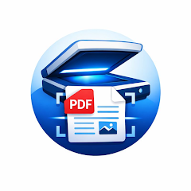

  

<h1 align="center">Сканер документов PDF</h1>

  <b>Превратите бумагу в чистый, читаемый многостраничный PDF — быстро. Снимайте камерой, правьте края, улучшайте страницу, экспортируйте. iOS и Android.</b>

  
  

  
  
  
  
  
  

  <b>Языки:</b>
  <a href="README.md">English</a> · <a href="README.es.md">Español</a> · <a href="README.pt-BR.md">Português</a> · <a href="README.de.md">Deutsch</a> · <a href="README.fr.md">Français</a> · <a href="README.it.md">Italiano</a> · <a href="README.nl.md">Nederlands</a> · <a href="README.pl.md">Polski</a> · <a href="README.cs.md">Čeština</a> · <a href="README.uk.md">Українська</a> · <a href="README.tr.md">Türkçe</a> · <a href="README.ar.md">العربية</a> · <a href="README.hi.md">हिन्दी</a> · <a href="README.zh-CN.md">中文</a> · <a href="README.ja.md">日本語</a> · <a href="README.ko.md">한국어</a> · <a href="README.id.md">Bahasa Indonesia</a> · <a href="README.vi.md">Tiếng Việt</a> · <a href="README.th.md">ภาษาไทย</a>

---

## Что такое Сканер документов PDF?

**Сканер документов PDF** — это сфокусированный мобильный сканер без излишеств для Android и iPhone. Наведите камеру на документ, дайте приложению автоматически определить края, исправьте перспективу, улучшите страницу и экспортируйте многостраничный PDF. Весь процесс — на устройстве. Без аккаунта, без загрузок, без подписки.

Сделан для того, что люди реально сканируют: чеки, счета, договоры, удостоверения, домашние задания, визитки, рукописные заметки, конспекты, книги и формы для отправки по почте или загрузки в портал.

## Главные возможности

### Съёмка
- **Сканирование камерой** с автоматическим определением краёв
- **Импорт из фото** — превращает существующее изображение в отсканированную страницу
- **Многостраничная съёмка** — добавляйте страницы по необходимости

### Очистка
- **Автоматическая коррекция перспективы** — страница получается плоской и прямоугольной даже под углом
- **Ручная коррекция краёв** когда автоматика ошибается
- **Фильтры документа** — чистый Ч/Б, оттенки серого, цвет, магическая очистка
- **Яркость и контраст** для финальной отстройки

### Организация
- **Многостраничные документы** — добавляйте, удаляйте и перетаскивайте
- **Локальная библиотека** — сканы остаются на устройстве

### Экспорт
- **Экспорт PDF** с опциями качества (малый / стандарт / высокое)
- **Поделиться** в почту, мессенджеры, облако — куда угодно, где принимают PDF
- **Сохранить** на устройство или в любимую облачную папку

## Сценарии

| Ситуация | Что делает приложение |
|----------|------------------------|
| Чек | Скан, обрезка, магическая очистка, одностраничный PDF |
| Многостраничный договор | Захват, упорядочивание и экспорт одним PDF |
| Удостоверение | Лицо и оборот в одном PDF |
| Фото доски | Коррекция цвета для читаемости |
| Рукописные заметки | Ч/Б фильтр для чётких линий |
| Конспект | Локальная библиотека |
| Визитки | Передать в Контакты |
| Школьное задание | PDF для учителя |
| Страховая форма | PDF для портала |
| Старый фотоальбом | Цифровая копия в PDF |

## Как это работает

**Как происходит распознавание краёв?**
Приложение анализирует каждый кадр и ищет прямоугольник, наиболее похожий на документ. Углы можно поправить вручную.

**Что делает «магическая очистка»?**
Поднимает контраст, убирает тени и превращает фотографии замусоленной бумаги в белые страницы с чётким текстом.

**Загружаются ли мои сканы?**
Нет. Всё происходит на устройстве.

**Можно ли сделать один PDF из нескольких фото из галереи?**
Да. Импортируйте по одному, упорядочьте и экспортируйте одним PDF.

## Скачать

| Платформа | Магазин | Идентификатор |
|-----------|---------|---------------|
| Android | [Google Play](https://play.google.com/store/apps/details?id=com.tomas.document_scanner_pdf) | `com.tomas.document_scanner_pdf` |
| iOS | [App Store](https://apps.apple.com/us/app/id6759046751) | `id6759046751` |

**Поддержка:** [github.com/Lapnito/document-scanner-pdf/issues](https://github.com/Lapnito/document-scanner-pdf/issues)

## Часто задаваемые вопросы

**Действительно бесплатно?**
Да. Без платных функций.

**Нужен ли аккаунт?**
Нет.

**Загружаются ли документы?**
Нет. Всё обрабатывается на устройстве.

**Максимум страниц в PDF?**
Жёсткого предела нет. Только память устройства.

**Можно ли отредактировать сохранённый скан?**
Да — снова открыть, добавить или удалить страницы, переприменить фильтры и экспортировать.

**Зачем нужен доступ к камере?**
Это единственный способ снять страницу. Камера используется только для сканирования.

**Зачем нужен доступ к фото?**
Чтобы выбрать существующие изображения и сохранить PDF.

**Делает ли OCR?**
Эта версия сфокусирована на чистом, готовом к отправке PDF. Поисковый OCR — в дорожной карте.

**Какие устройства поддерживаются?**
Android с камерой, iPhone / iPad с iOS 13.0 и выше.

**Как сообщить об ошибке?**
Создайте issue на [github.com/Lapnito/document-scanner-pdf/issues](https://github.com/Lapnito/document-scanner-pdf/issues) или напишите на tom@lapnito.cz.

## Технологии

- **Фреймворк:** Flutter (Android и iOS)
- **Сенсоры:** Камера
- **Обработка:** Перспектива, фильтры и PDF на устройстве
- **Минимум Android:** Android 6.0 (API 23) или новее
- **Минимум iOS:** iOS 13.0
- **Языки этого README:** English, Español, Português, Deutsch, Français, Italiano, Nederlands, Polski, Čeština, Українська, Русский, Türkçe, العربية, हिन्दी, 中文, 日本語, 한국어, Bahasa Indonesia, Tiếng Việt, ภาษาไทย

## О разработчике

Сканер документов PDF создан **lapnito.cz s.r.o.** (Lapnito Development Studio) — чешской студией, которая публикует небольшие, сфокусированные утилиты без рекламы.

- **Поддержка:** [github.com/Lapnito/document-scanner-pdf/issues](https://github.com/Lapnito/document-scanner-pdf/issues)
- **E-mail:** tom@lapnito.cz
- **Больше приложений в Google Play:** [Lapnito Development Studio](https://play.google.com/store/apps/dev?id=8923575656207320763)
- **Больше приложений в App Store:** [lapnito.cz s.r.o.](https://apps.apple.com/us/developer/lapnito-cz-s-r-o/id1577358577)

---

Сделано с ❤️ в Чехии — <a href="https://github.com/Lapnito">lapnito.cz s.r.o.</a>

